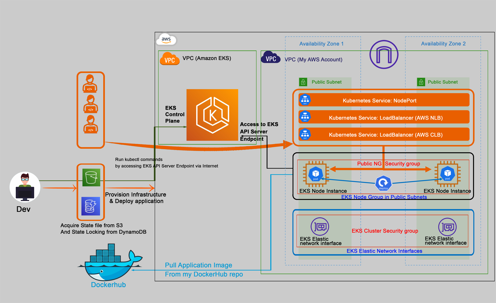

# Deploy to EKS using Terraform

This repo is about deploying an Application to EKS using Terraform.

In this demonstration, I created Terraform configuration files and used terraform commands to provision resources and deploy a sample application.
This project is divided into two sections. The first one is creating the infrastructure using terraform which is a continuation of my previous project where I created the EKS cluster using the aws console. www.eks-console.cloud2day.link

In the second section of the project, I wrote terraform deployment configuration files that deploy the application to the cluster.
The sample application is a simple node application that I created and create a container image of the application and push to docker hub. 
I could also push the application image to ECR, which in that case will be very easy to deploy to EKS.
At the end of the project, both the infrastructure and the application were created using terraform configurations. 
The application can be accessed via NodePort service, classic and Network loadbalancers.

Click on this link to view the full details of the project http://www.deploy2eks.cloud2day.link/